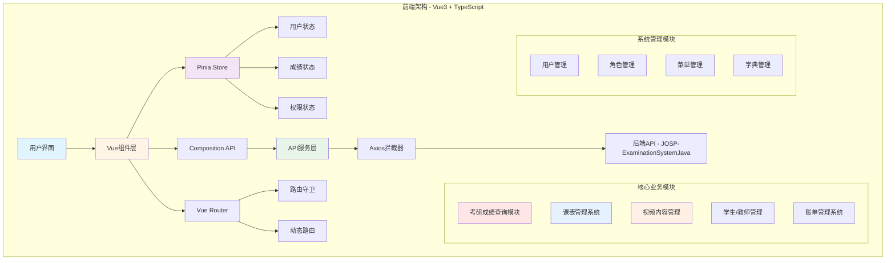

# 🎓 JOSP-ExaminationSystemVue3 - 考研成绩查询与管理系统前端


> 基于vue3-element-admin模板的考研成绩查询与综合管理系统前端

## 📖 项目简介

JOSP-ExaminationSystemVue3 是一个功能丰富的考研成绩查询与综合管理系统前端项目,基于vue3-element-admin模板开发,集成考研成绩查询、课表管理、视频管理等多个子系统。

### 🎯 项目定位

本项目是一个**综合性的考研管理平台前端**,包含:
- ✅ 考研成绩查询与分析系统(核心功能)
- ✅ 课程表管理系统
- ✅ 视频内容管理平台
- ✅ 学生/教师信息管理
- ✅ 个人账单管理系统
- ✅ 数据可视化与图表展示

### ✨ 核心特性

- 🎨 **响应式设计** - 完美适配桌面端和移动端
- 🚀 **Vue3 Composition API** - 使用最新的组合式API
- 💾 **Pinia状态管理** - 轻量级状态管理方案
- 🎯 **Element Plus** - 现代化UI组件库
- 📊 **ECharts图表** - 数据可视化展示
- 🔐 **RBAC权限控制** - 基于角色的访问控制
- 🌐 **国际化支持** - vue-i18n多语言
- 📝 **富文本编辑** - wangEditor编辑器集成

## 🏗️ 系统架构



## 🛠️ 技术栈

| 技术 | 版本 | 说明 |
|------|------|------|
| Vue | 3.5.32 | 渐进式JavaScript框架 |
| Vite | 8.0.9 | 下一代前端构建工具 |
| Element Plus | 2.13.7 | Vue3 UI组件库 |
| Pinia | 3.0.4 | Vue3状态管理 |
| Vue Router | 5.0.4 | Vue3官方路由 |
| Axios | 1.15.1 | HTTP客户端 |
| ECharts | 6.0.0 | 数据可视化库 |
| TypeScript | 6.0.3 | JavaScript超集 |
| wangEditor | 5.1.23 | 富文本编辑器 |
| vue-i18n | 11.3.0 | 国际化解决方案 |
| XLSX | 0.18.5 | Excel文件处理 |

## 🚀 快速开始

### 环境要求

- Node.js >= 16.0.0
- npm >= 8.0.0 或 pnpm >= 8.0.0

### 安装步骤

```bash
# 克隆项目
git clone https://github.com/your-username/JOSP-ExaminationSystemVue3.git

# 进入项目目录
cd JOSP-ExaminationSystemVue3

# 安装依赖
npm install
# 或使用 pnpm
pnpm install

# 启动开发服务器
npm run dev

# 构建生产版本
npm run build

# 预览生产构建
npm run preview
```

## 📁 项目结构

```
JOSP-ExaminationSystemVue3/
├── public/              # 静态资源
├── src/
│   ├── api/            # API接口
│   ├── assets/         # 资源文件
│   ├── components/     # 公共组件
│   ├── composables/    # 组合式函数
│   ├── directives/     # 自定义指令
│   ├── layouts/        # 布局组件
│   ├── router/         # 路由配置
│   ├── stores/         # Pinia状态
│   ├── styles/         # 样式文件
│   ├── utils/          # 工具函数
│   └── views/          # 页面组件
├── .env.development    # 开发环境变量
├── .env.production     # 生产环境变量
├── vite.config.js      # Vite配置
└── package.json        # 项目依赖
```

## 💡 核心功能模块

### 1. 考研成绩查询系统

#### 功能列表:
- **国家线查询** - 查询历年国家分数线(A/B区、学硕/专硕)
- **院校线查询** - 查询各院校复试分数线
- **复试名单查询** - 按专业查询复试名单
- **马克思主义理论专业** - 专业代码030500成绩查询
- **科学技术史专业** - 专业代码071200成绩查询  
- **科学技术哲学专业** - 专业代码010108成绩查询

#### 核心组件:
```vue
<!-- src/views/examinationSystemTable/queryNationLineTable.vue -->
<!-- 国家线查询表格,支持A/B类、学硕/专硕筛选 -->
<el-select v-model="listQuery.studentClass" placeholder="A/B地区">
  <el-option key="A" label="A类" value="A" />
  <el-option key="B" label="B类" value="B" />
</el-select>

<!-- src/views/examinationSystemTable/queryReviewListAllTable.vue -->
<!-- 复试名单查询,支持按姓名、专业代码、录取情况筛选 -->
<el-input v-model="listQuery.studentName" placeholder="姓名" />
<el-select v-model="listQuery.subjectCode" placeholder="专业代码">
  <el-option key="030500" label="马克思主义理论" />
  <el-option key="071200" label="科学技术史" />
  <el-option key="010108" label="科学技术哲学" />
</el-select>
```

#### 数据字段:
- **考生信息**: 姓名、考生编号、专业代码、专业名称
- **成绩信息**: 政治、英语、专业课一、专业课二、总分
- **排名信息**: 初试排名
- **其他**: 公共课总分、专业课总分、备注

### 2. 课表管理系统

```vue
<!-- src/views/AmyselfPage/classSystem/class-system.vue -->
<!-- 支持多教室课表展示、学生/教师信息管理 -->
<el-table :data="class_data" border>
  <el-table-column label="时间" prop="class_time" />
  <el-table-column label="教室1">
    <el-table-column label="学生" prop="st_name" />
    <el-table-column label="科目" prop="st_subject" />
    <el-table-column label="老师" prop="teacher_name" />
  </el-table-column>
</el-table>
```

功能特性:
- 多教室课表展示
- 学生信息弹窗编辑
- 教师信息管理
- 账单记录功能

### 3. 视频内容管理系统

```vue
<!-- src/views/AmyselfPage/videoListManage/video-list-manage.vue -->
<!-- 视频列表管理,支持多维度筛选 -->
<el-form :inline="true" :model="formInline">
  <el-form-item label="封面设计师">
    <el-select filterable>
      <el-option v-for="item in tabledata" :key="item.table_designer" />
    </el-select>
  </el-form-item>
  <el-form-item label="配音员">
    <el-select>
      <el-option v-for="item in tabledata" :key="item.table_audio" />
    </el-select>
  </el-form-item>
</el-form>
```

管理维度:
- 封面设计师筛选
- 配音员筛选
- 文章作者筛选
- 剪辑师筛选
- 时间范围筛选

### 4. 用户权限管理

基于RBAC模型的权限控制系统:
- **用户管理** - 用户增删改查、分配角色
- **角色管理** - 角色定义、权限分配
- **菜单管理** - 动态菜单配置
- **部门管理** - 组织架构管理
- **字典管理** - 数据字典维护

## 🎨 UI界面

### 主要功能页面:

#### 考研成绩查询模块:
- **国家线查询** - A/B区国家线分数表查询
- **院校线查询** - 各院校复试分数线查询
- **复试名单查询** - 按专业查询复试名单
- **成绩管理** - 成绩数据的增删改查
- **Excel导出** - 支持导出Excel格式成绩单

#### 个人管理模块:
- **课表系统** - 多教室课表展示与管理
- **视频管理** - 视频内容多维度管理
- **账单管理** - 个人账单记录系统
- **学生/教师管理** - 信息登记与维护

#### 系统管理模块:
- **用户管理** - 用户账号管理
- **角色权限** - 角色与权限配置
- **菜单管理** - 动态菜单配置
- **数据字典** - 字典数据维护

## 🔧 开发指南

### 环境变量配置

```env
# .env.development
VITE_API_BASE_URL=http://localhost:8080/api
VITE_APP_TITLE=考研成绩查询系统

# .env.production
VITE_API_BASE_URL=https://api.example.com
VITE_APP_TITLE=考研成绩查询系统
```

### 代码规范

```javascript
// .eslintrc.js
module.exports = {
  extends: [
    'plugin:vue/vue3-essential',
    'eslint:recommended',
    '@vue/prettier'
  ],
  rules: {
    'vue/multi-word-component-names': 'off',
    'no-console': process.env.NODE_ENV === 'production' ? 'warn' : 'off'
  }
}
```

## 📦 构建部署

### 构建命令

```bash
# 开发环境
npm run dev

# 生产构建
npm run build

# 预览构建结果
npm run preview

# 代码检查
npm run lint

# 代码格式化
npm run format
```

### Docker部署

```dockerfile
# Dockerfile
FROM node:18-alpine as build-stage
WORKDIR /app
COPY package*.json ./
RUN npm install
COPY . .
RUN npm run build

FROM nginx:alpine as production-stage
COPY --from=build-stage /app/dist /usr/share/nginx/html
EXPOSE 80
CMD ["nginx", "-g", "daemon off;"]
```

## 🔗 相关项目

### 后端项目:
- **JOSP-ExaminationSystemJava** - 考研成绩查询系统后端API
  - 提供成绩查询、用户管理、权限控制等RESTful API
  - 基于Spring Boot + MyBatis-Plus开发
  - 支持MySQL数据持久化

### 技术来源:
- **vue3-element-admin** - 本项目基于该模板开发
  - 仓库地址: https://gitee.com/youlaiorg/vue3-element-admin.git
  - 感谢有来开源组织提供的优秀模板

## 📝 更新日志

### v1.0.0 (2024-01-01)
- ✨ 初始版本发布
- 🎨 完成响应式UI设计
- 🚀 集成Element Plus组件库
- 📊 添加ECharts图表展示

## 👥 作者

- **开发者**: JOSP Team
- **邮箱**: your-email@example.com

## 📄 许可证

本项目采用 MIT 许可证 - 详见 [LICENSE](LICENSE) 文件

---

⭐️ 如果这个项目对你有帮助,请给一个星标支持!
