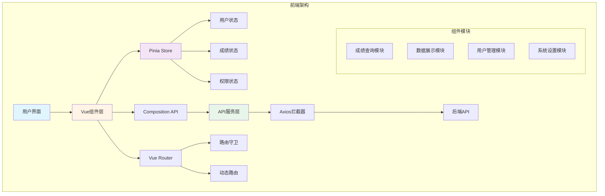

# 🎓 JOSP-ExaminationSystemVue3 - 考研成绩查询系统前端


> Vue3前端 - 考研成绩查询系统的现代化响应式界面

## 📖 项目简介

JOSP-ExaminationSystemVue3 是考研成绩查询系统的前端项目,基于Vue3全家桶构建,提供响应式的成绩查询、数据展示和后台管理界面。

### ✨ 核心特性

- 🎨 **响应式设计** - 完美适配桌面端和移动端
- 🚀 **Vue3 Composition API** - 使用最新的组合式API
- 💾 **Pinia状态管理** - 轻量级状态管理方案
- 🎯 **Element Plus** - 现代化UI组件库
- 📊 **ECharts图表** - 数据可视化展示
- 🔐 **权限控制** - 基于角色的访问控制

## 🏗️ 系统架构



## 🛠️ 技术栈

| 技术 | 版本 | 说明 |
|------|------|------|
| Vue | 3.3.4 | 渐进式JavaScript框架 |
| Vite | 4.4.9 | 下一代前端构建工具 |
| Element Plus | 2.3.14 | Vue3 UI组件库 |
| Pinia | 2.1.6 | Vue3状态管理 |
| Vue Router | 4.2.5 | Vue3官方路由 |
| Axios | 1.5.0 | HTTP客户端 |
| ECharts | 5.4.3 | 数据可视化库 |

## 🚀 快速开始

### 环境要求

- Node.js >= 16.0.0
- npm >= 8.0.0 或 pnpm >= 8.0.0

### 安装步骤

```bash
# 克隆项目
git clone https://github.com/your-username/JOSP-ExaminationSystemVue3.git

# 进入项目目录
cd JOSP-ExaminationSystemVue3

# 安装依赖
npm install
# 或使用 pnpm
pnpm install

# 启动开发服务器
npm run dev

# 构建生产版本
npm run build

# 预览生产构建
npm run preview
```

## 📁 项目结构

```
JOSP-ExaminationSystemVue3/
├── public/              # 静态资源
├── src/
│   ├── api/            # API接口
│   ├── assets/         # 资源文件
│   ├── components/     # 公共组件
│   ├── composables/    # 组合式函数
│   ├── directives/     # 自定义指令
│   ├── layouts/        # 布局组件
│   ├── router/         # 路由配置
│   ├── stores/         # Pinia状态
│   ├── styles/         # 样式文件
│   ├── utils/          # 工具函数
│   └── views/          # 页面组件
├── .env.development    # 开发环境变量
├── .env.production     # 生产环境变量
├── vite.config.js      # Vite配置
└── package.json        # 项目依赖
```

## 💡 核心功能

### 1. 成绩查询模块

```vue
<template>
  <div class="score-query">
    <el-form :model="queryForm" :rules="rules" ref="formRef">
      <el-form-item label="准考证号" prop="examId">
        <el-input v-model="queryForm.examId" placeholder="请输入准考证号" />
      </el-form-item>
      <el-form-item label="身份证号" prop="idCard">
        <el-input v-model="queryForm.idCard" placeholder="请输入身份证号" />
      </el-form-item>
      <el-form-item>
        <el-button type="primary" @click="handleQuery">查询成绩</el-button>
      </el-form-item>
    </el-form>
    
    <el-card v-if="scoreData" class="score-card">
      <template #header>
        <span>成绩详情</span>
      </template>
      <el-descriptions :column="2" border>
        <el-descriptions-item label="考生姓名">{{ scoreData.name }}</el-descriptions-item>
        <el-descriptions-item label="总分">{{ scoreData.totalScore }}</el-descriptions-item>
        <el-descriptions-item label="政治">{{ scoreData.politics }}</el-descriptions-item>
        <el-descriptions-item label="英语">{{ scoreData.english }}</el-descriptions-item>
        <el-descriptions-item label="专业课一">{{ scoreData.major1 }}</el-descriptions-item>
        <el-descriptions-item label="专业课二">{{ scoreData.major2 }}</el-descriptions-item>
      </el-descriptions>
    </el-card>
  </div>
</template>

<script setup>
import { ref, reactive } from 'vue'
import { ElMessage } from 'element-plus'
import { queryScore } from '@/api/score'

const formRef = ref(null)
const scoreData = ref(null)

const queryForm = reactive({
  examId: '',
  idCard: ''
})

const rules = {
  examId: [{ required: true, message: '请输入准考证号', trigger: 'blur' }],
  idCard: [{ required: true, message: '请输入身份证号', trigger: 'blur' }]
}

const handleQuery = async () => {
  await formRef.value.validate()
  const res = await queryScore(queryForm)
  if (res.code === 200) {
    scoreData.value = res.data
    ElMessage.success('查询成功')
  }
}
</script>
```

### 2. 状态管理

```javascript
// stores/score.js
import { defineStore } from 'pinia'
import { getScoreList, getStatistics } from '@/api/score'

export const useScoreStore = defineStore('score', {
  state: () => ({
    scoreList: [],
    statistics: null,
    loading: false
  }),
  
  getters: {
    totalStudents: (state) => state.statistics?.total || 0,
    averageScore: (state) => state.statistics?.average || 0
  },
  
  actions: {
    async fetchScoreList(params) {
      this.loading = true
      try {
        const res = await getScoreList(params)
        this.scoreList = res.data.list
        return res
      } finally {
        this.loading = false
      }
    },
    
    async fetchStatistics() {
      const res = await getStatistics()
      this.statistics = res.data
      return res
    }
  }
})
```

### 3. 路由配置

```javascript
// router/index.js
import { createRouter, createWebHistory } from 'vue-router'
import { useUserStore } from '@/stores/user'

const routes = [
  {
    path: '/',
    name: 'Layout',
    component: () => import('@/layouts/MainLayout.vue'),
    redirect: '/home',
    children: [
      {
        path: 'home',
        name: 'Home',
        component: () => import('@/views/Home.vue'),
        meta: { title: '首页' }
      },
      {
        path: 'query',
        name: 'Query',
        component: () => import('@/views/Query.vue'),
        meta: { title: '成绩查询' }
      },
      {
        path: 'admin',
        name: 'Admin',
        component: () => import('@/views/admin/Index.vue'),
        meta: { title: '后台管理', requiresAuth: true },
        children: [
          {
            path: 'students',
            name: 'Students',
            component: () => import('@/views/admin/Students.vue'),
            meta: { title: '学生管理' }
          },
          {
            path: 'scores',
            name: 'Scores',
            component: () => import('@/views/admin/Scores.vue'),
            meta: { title: '成绩管理' }
          }
        ]
      }
    ]
  }
]

const router = createRouter({
  history: createWebHistory(),
  routes
})

// 路由守卫
router.beforeEach((to, from, next) => {
  const userStore = useUserStore()
  
  if (to.meta.requiresAuth && !userStore.isLoggedIn) {
    next('/login')
  } else {
    next()
  }
})

export default router
```

### 4. API请求封装

```javascript
// utils/request.js
import axios from 'axios'
import { ElMessage } from 'element-plus'

const service = axios.create({
  baseURL: import.meta.env.VITE_API_BASE_URL,
  timeout: 10000
})

// 请求拦截器
service.interceptors.request.use(
  config => {
    const token = localStorage.getItem('token')
    if (token) {
      config.headers['Authorization'] = `Bearer ${token}`
    }
    return config
  },
  error => {
    return Promise.reject(error)
  }
)

// 响应拦截器
service.interceptors.response.use(
  response => {
    const res = response.data
    if (res.code !== 200) {
      ElMessage.error(res.message || '请求失败')
      return Promise.reject(new Error(res.message || 'Error'))
    }
    return res
  },
  error => {
    ElMessage.error(error.message || '网络错误')
    return Promise.reject(error)
  }
)

export default service
```

## 🎨 UI界面

### 主要页面展示

- **首页** - 系统介绍和快速查询入口
- **成绩查询** - 学生成绩查询表单
- **成绩详情** - 成绩展示和打印功能
- **后台管理** - 学生信息、成绩数据管理
- **数据统计** - 图表展示成绩分布情况

## 🔧 开发指南

### 环境变量配置

```env
# .env.development
VITE_API_BASE_URL=http://localhost:8080/api
VITE_APP_TITLE=考研成绩查询系统

# .env.production
VITE_API_BASE_URL=https://api.example.com
VITE_APP_TITLE=考研成绩查询系统
```

### 代码规范

```javascript
// .eslintrc.js
module.exports = {
  extends: [
    'plugin:vue/vue3-essential',
    'eslint:recommended',
    '@vue/prettier'
  ],
  rules: {
    'vue/multi-word-component-names': 'off',
    'no-console': process.env.NODE_ENV === 'production' ? 'warn' : 'off'
  }
}
```

## 📦 构建部署

### 构建命令

```bash
# 开发环境
npm run dev

# 生产构建
npm run build

# 预览构建结果
npm run preview

# 代码检查
npm run lint

# 代码格式化
npm run format
```

### Docker部署

```dockerfile
# Dockerfile
FROM node:18-alpine as build-stage
WORKDIR /app
COPY package*.json ./
RUN npm install
COPY . .
RUN npm run build

FROM nginx:alpine as production-stage
COPY --from=build-stage /app/dist /usr/share/nginx/html
EXPOSE 80
CMD ["nginx", "-g", "daemon off;"]
```

## 🔗 相关项目

- 后端项目: [JOSP-ExaminationSystemJava](../JOSP-ExaminationSystemJava)
- API文档: [在线API文档](https://api.example.com/docs)

## 📝 更新日志

### v1.0.0 (2024-01-01)
- ✨ 初始版本发布
- 🎨 完成响应式UI设计
- 🚀 集成Element Plus组件库
- 📊 添加ECharts图表展示

## 👥 作者

- **开发者**: JOSP Team
- **邮箱**: your-email@example.com

## 📄 许可证

本项目采用 MIT 许可证 - 详见 [LICENSE](LICENSE) 文件

---

⭐️ 如果这个项目对你有帮助,请给一个星标支持!
