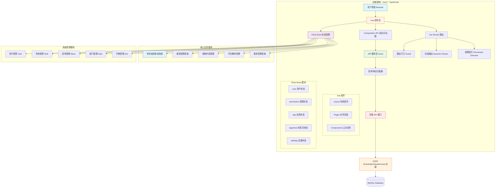
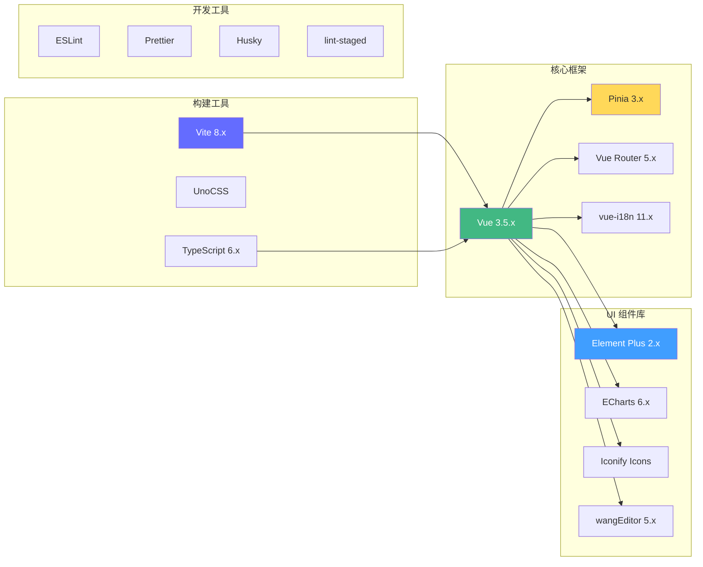

# JOSP-ExaminationSystemVue3 - 考研成绩查询与管理系统前端

## 项目简介

JOSP-ExaminationSystemVue3 是一个基于 **vue3-element-admin** 模板开发的**考研成绩查询与综合管理系统前端**。系统集成考研成绩查询、课程表管理、视频内容管理、学生教师信息管理等多个业务模块，采用 Vue3 Composition API + TypeScript 构建，提供现代化的管理体验。

### 项目定位

本项目是一个**综合性的考研管理平台**，核心功能包括：

- 考研成绩查询与分析系统（核心功能）
- 课程表管理系统
- 视频内容管理平台
- 学生/教师信息管理
- 个人账单管理系统
- 数据可视化与图表展示

### 技术特点

- **Vue3 Composition API** - 使用最新的组合式 API 开发
- **TypeScript** - 类型安全的开发体验
- **Pinia** - 轻量级状态管理方案
- **Element Plus** - 现代化 UI 组件库
- **ECharts** - 数据可视化图表展示
- **RBAC 权限控制** - 基于角色的访问控制
- **vue-i18n** - 国际化支持
- **wangEditor** - 富文本编辑器集成

---

## 系统架构

### 整体架构图



### 前端技术架构



---

## 技术栈

### 核心技术

| 技术 | 版本 | 说明 |
|------|------|------|
| Vue | 3.5.32 | 渐进式 JavaScript 框架 |
| Vite | 8.0.9 | 下一代前端构建工具 |
| TypeScript | 6.0.3 | JavaScript 超集，提供类型检查 |
| Element Plus | 2.13.7 | Vue3 UI 组件库 |
| Pinia | 3.0.4 | Vue3 状态管理库 |
| Vue Router | 5.0.4 | Vue3 官方路由管理器 |
| Axios | 1.15.1 | HTTP 客户端库 |

### 数据可视化与富文本

| 技术 | 版本 | 说明 |
|------|------|------|
| ECharts | 6.0.0 | 数据可视化图表库 |
| vue-echarts | 8.0.1 | ECharts 的 Vue3 封装 |
| wangEditor | 5.1.23 | Web 富文本编辑器 |

### 国际化与工具库

| 技术 | 版本 | 说明 |
|------|------|------|
| vue-i18n | 11.3.0 | Vue3 国际化插件 |
| lodash-es | 4.17.23 | 函数式工具库 |
| @vueuse/core | 14.2.1 | Vue Composition API 工具集 |
| ExcelJS | 4.4.0 | Excel 文件处理 |
| xlsx | 0.18.5 | Excel/CSV 解析与导出 |

### 开发工具

| 技术 | 版本 | 说明 |
|------|------|------|
| UnoCSS | 66.6.7 | 原子化 CSS 引擎 |
| ESLint | 10.1.0 | 代码质量检查 |
| Prettier | 3.8.1 | 代码格式化 |
| Husky | 9.1.7 | Git Hooks 工具 |
| vite-plugin-vue-devtools | 8.1.1 | Vue 开发工具插件 |

---

## 功能说明

### 1. 考研成绩查询系统（核心功能）

#### 1.1 国家线查询
- 查询历年国家分数线
- 支持 A 类/B 类地区筛选
- 支持学硕/专硕类型筛选
- 显示单科分数和总分要求

#### 1.2 院校线查询
- 各院校复试分数线查询
- 按院校名称、专业代码筛选
- 显示院线与国家线对比

#### 1.3 复试名单查询
- 按专业查询复试名单
- 支持姓名、考生编号筛选
- 显示初试排名和录取情况

#### 1.4 支持专业
| 专业代码 | 专业名称 |
|----------|----------|
| 030500 | 马克思主义理论 |
| 071200 | 科学技术史 |
| 010108 | 科学技术哲学 |

#### 1.5 成绩数据字段
| 字段类别 | 具体字段 |
|----------|----------|
| 考生信息 | 姓名、考生编号、专业代码、专业名称 |
| 成绩信息 | 政治、英语、专业课一、专业课二、总分 |
| 排名信息 | 初试排名 |
| 其他 | 公共课总分、专业课总分、备注 |

### 2. 课表管理系统

- 多教室课表展示
- 学生信息弹窗编辑
- 教师信息管理
- 账单记录功能
- 支持时间维度查询

### 3. 视频内容管理系统

- 多维度内容筛选
- 封面设计师筛选
- 配音员筛选
- 文章作者筛选
- 剪辑师筛选
- 时间范围筛选

### 4. 学生/教师信息管理

- 学生信息登记与维护
- 教师信息管理
- 批量导入导出

### 5. 个人账单管理

- 账单记录系统
- 账单分类统计
- 收支明细查询

### 6. 系统管理模块

#### 6.1 用户管理
- 用户账号 CRUD
- 分配用户角色
- 启用/禁用账号

#### 6.2 角色管理
- 角色定义
- 权限分配
- 角色菜单配置

#### 6.3 菜单管理
- 动态菜单配置
- 菜单图标管理
- 菜单排序

#### 6.4 部门管理
- 组织架构管理
- 部门树形结构
- 部门负责人配置

#### 6.5 字典管理
- 数据字典维护
- 字典类型管理
- 字典项增删改查

### 7. 数据可视化

- 雷达图展示
- 饼图分析
- 漏斗图统计
- 柱状图对比

### 8. 其他功能

- WebSocket 实时通信示例
- 富文本编辑
- 文件上传
- 签名功能
- 路由参数示例

---

## 项目结构

```
JOSP-ExaminationSystemVue3/
├── public/                     # 静态资源（favicon 等）
├── src/
│   ├── api/                    # API 接口模块
│   │   ├── auth/               # 认证接口
│   │   ├── user/               # 用户接口
│   │   ├── role/               # 角色接口
│   │   ├── menu/               # 菜单接口
│   │   ├── dept/               # 部门接口
│   │   ├── dict/               # 字典接口
│   │   └── file/               # 文件接口
│   ├── assets/                 # 资源文件
│   │   └── icons/              # SVG 图标
│   ├── components/             # 公共组件
│   │   ├── Breadcrumb/         # 面包屑导航
│   │   ├── CURD/               # 增删改查组件
│   │   ├── Dictionary/         # 字典组件
│   │   ├── Hamburger/          # 折叠菜单
│   │   ├── IconSelect/         # 图标选择器
│   │   ├── LangSelect/         # 语言切换
│   │   ├── Pagination/         # 分页组件
│   │   ├── SizeSelect/         # 表格大小选择
│   │   ├── SvgIcon/            # SVG 图标组件
│   │   ├── TableSelect/        # 表格选择器
│   │   ├── Upload/             # 文件上传
│   │   └── WangEditor/         # 富文本编辑器
│   ├── composables/            # 组合式函数
│   ├── directive/              # 自定义指令
│   │   └── permission/          # 权限指令
│   ├── enums/                  # 枚举定义
│   ├── lang/                    # 国际化语言包
│   ├── layout/                 # 布局组件
│   │   └── components/
│   │       ├── AppMain/        # 主内容区
│   │       ├── NavBar/         # 导航栏
│   │       ├── Settings/       # 设置面板
│   │       ├── Sidebar/        # 侧边栏
│   │       └── TagsView/       # 标签页
│   ├── router/                 # 路由配置
│   ├── store/                  # Pinia 状态管理
│   │   └── modules/
│   │       ├── app.ts          # 应用状态
│   │       ├── permission.ts   # 权限状态
│   │       ├── settings.ts      # 设置状态
│   │       ├── tagsView.ts     # 标签页状态
│   │       └── user.ts         # 用户状态
│   ├── styles/                 # 样式文件
│   │   └── variables.scss      # SCSS 变量
│   ├── typings/                # TypeScript 类型声明
│   ├── utils/                  # 工具函数
│   └── views/                  # 页面组件
│       ├── dashboard/          # 仪表盘
│       ├── demo/                # 示例页面
│       ├── error-page/         # 错误页面
│       ├── examinationSystemTable/  # 考研成绩查询
│       ├── login/              # 登录页
│       ├── redirect/           # 重定向页
│       └── system/             # 系统管理
├── .env.development            # 开发环境变量
├── .env.production             # 生产环境变量
├── index.html                  # HTML 入口
├── package.json                # 项目依赖
├── tsconfig.json               # TypeScript 配置
├── vite.config.ts              # Vite 配置
├── eslint.config.js            # ESLint 配置
└── uno.config.ts               # UnoCSS 配置
```

---

## 快速开始

### 环境要求

| 环境 | 版本要求 |
|------|----------|
| Node.js | >= 18.0.0 |
| pnpm | >= 8.0.0（推荐） |
| npm | >= 8.0.0 |

### 安装步骤

```bash
# 克隆项目
git clone https://github.com/your-username/JOSP-ExaminationSystemVue3.git

# 进入项目目录
cd JOSP-ExaminationSystemVue3

# 使用 pnpm 安装依赖（推荐）
pnpm install

# 或使用 npm
npm install

# 启动开发服务器
pnpm dev

# 构建生产版本
pnpm build

# 预览生产构建
pnpm preview
```

### 开发命令

| 命令 | 说明 |
|------|------|
| pnpm dev | 启动开发服务器 |
| pnpm build | 构建生产版本 |
| pnpm preview | 预览构建结果 |
| pnpm type-check | TypeScript 类型检查 |
| pnpm lint:eslint | ESLint 代码检查 |
| pnpm lint:prettier | Prettier 代码格式化 |
| pnpm lint:stylelint | Stylelint 样式检查 |
| pnpm lint:lint-staged | lint-staged 检查 |

---

## 环境变量配置

### 开发环境 (.env.development)

```env
# 应用端口
VITE_APP_PORT = 3000

# 代理前缀
VITE_APP_BASE_API = '/dev-api'

# 开发环境接口地址
VITE_APP_API_URL = http://localhost:8081

# 是否启用 Mock 服务（Vite 8 暂不支持）
VITE_MOCK_DEV_SERVER = false
```

### 生产环境 (.env.production)

```env
# 应用端口
VITE_APP_PORT = 3000

# 代理前缀
VITE_APP_BASE_API = '/prod-api'

# 生产环境接口地址
VITE_APP_API_URL = https://api.example.com
```

### 接口代理配置

Vite 配置了开发环境代理，将 `/dev-api` 前缀的请求转发到后端服务器：

```typescript
proxy: {
  [env.VITE_APP_BASE_API]: {
    changeOrigin: true,
    target: env.VITE_APP_API_URL,
    rewrite: (path) => path.replace(new RegExp("^" + env.VITE_APP_BASE_API), ""),
  },
}
```

---

## 部署说明

### 部署方式一：Nginx 部署

#### 1. 构建项目

```bash
pnpm build
```

构建产物位于 `dist` 目录。

#### 2. Nginx 配置

```nginx
server {
    listen 80;
    server_name your-domain.com;
    root /path/to/JOSP-ExaminationSystemVue3/dist;
    index index.html;

    # 处理 Vue Router Hash 模式路由
    location / {
        try_files $uri $uri/ /index.html;
    }

    # API 代理
    location /dev-api/ {
        proxy_pass http://backend-server:8081/;
        proxy_set_header Host $host;
        proxy_set_header X-Real-IP $remote_addr;
    }

    # 静态资源缓存
    location ~* \.(js|css|png|jpg|jpeg|gif|ico|svg|woff|woff2|ttf|eot)$ {
        expires 30d;
        add_header Cache-Control "public, immutable";
    }
}
```

### 部署方式二：Docker 部署

#### Dockerfile

```dockerfile
# 构建阶段
FROM node:18-alpine as build-stage
WORKDIR /app
COPY package*.json ./
RUN npm install -g pnpm
COPY . .
RUN pnpm build

# 运行阶段
FROM nginx:alpine as production-stage
COPY --from=build-stage /app/dist /usr/share/nginx/html
COPY nginx.conf /etc/nginx/conf.d/default.conf
EXPOSE 80
CMD ["nginx", "-g", "daemon off;"]
```

#### nginx.conf

```nginx
server {
    listen 80;
    server_name localhost;
    root /usr/share/nginx/html;
    index index.html;

    location / {
        try_files $uri $uri/ /index.html;
    }

    location /dev-api/ {
        proxy_pass http://host.docker.internal:8081/;
    }
}
```

#### 构建与运行

```bash
# 构建镜像
docker build -t josp-examination-system .

# 运行容器
docker run -d -p 80:80 --name josp josp-examination-system
```

### 部署方式三：Vercel / Netlify 部署

由于项目使用 **Hash 路由模式**，可直接部署到静态托管平台：

1. 修改 `vite.config.ts` 中的 `base` 配置
2. 执行 `pnpm build`
3. 上传 `dist` 目录到托管平台

---

## 后端配合

本项目为前端部分，需要配合后端项目使用：

| 项目 | 地址 | 说明 |
|------|------|------|
| 后端 API | JOSP-ExaminationSystemJava | Spring Boot + MyBatis-Plus |
| 数据库 | MySQL | 数据持久化 |

后端接口默认运行在 `http://localhost:8081`。

---

## 相关项目

- [vue3-element-admin](https://gitee.com/youlaiorg/vue3-element-admin) - 本项目基础模板，感谢有来开源组织
- [JOSP-ExaminationSystemJava](https://github.com/your-username/JOSP-ExaminationSystemJava) - 后端 API 项目

---

## 更新日志

### v2.11.5 (2024)
- 基于 vue3-element-admin 模板升级
- 升级至 Vue 3.5 + Vite 8
- 优化 TypeScript 类型支持

### v2.0.0 (2024)
- 新增考研成绩查询核心功能
- 重构系统管理模块
- 集成 ECharts 数据可视化

### v1.0.0 (2024-01-01)
- 初始版本发布
- 完成基础框架搭建

---

## 许可证

本项目采用 [MIT License](LICENSE) 许可证。

---

## 致谢

- 感谢 [有来开源组织](https://gitee.com/youlaiorg) 提供的 [vue3-element-admin](https://gitee.com/youlaiorg/vue3-element-admin) 模板
- 感谢所有开源项目的贡献者
